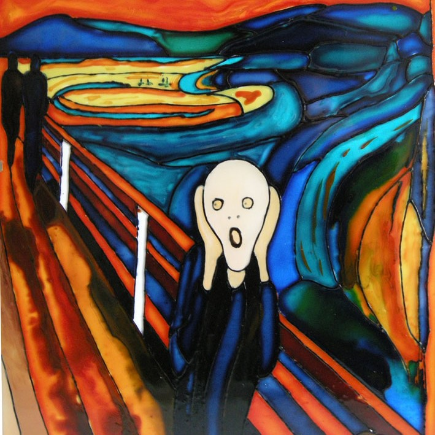
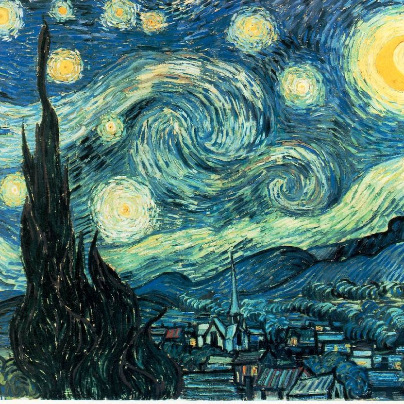
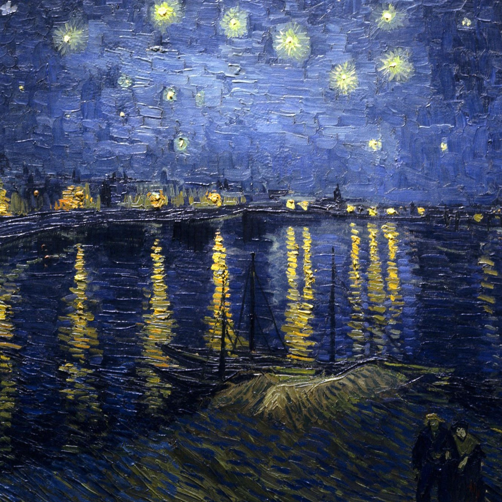
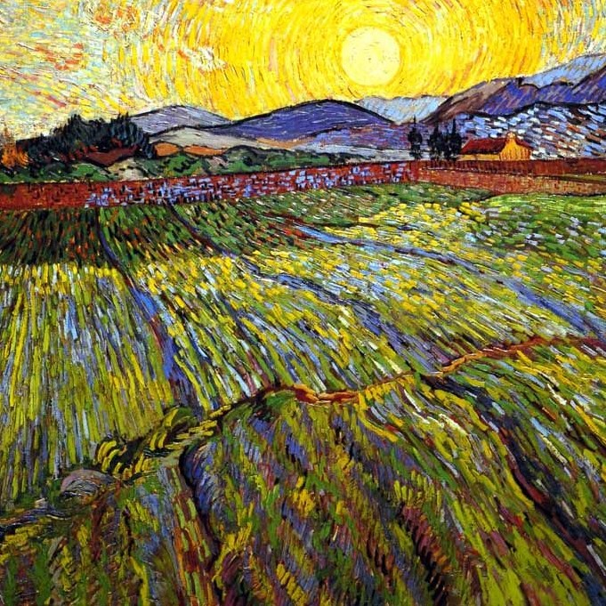
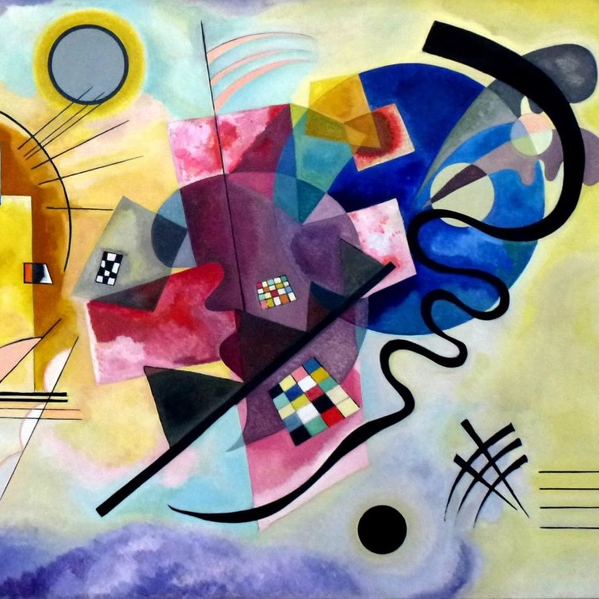
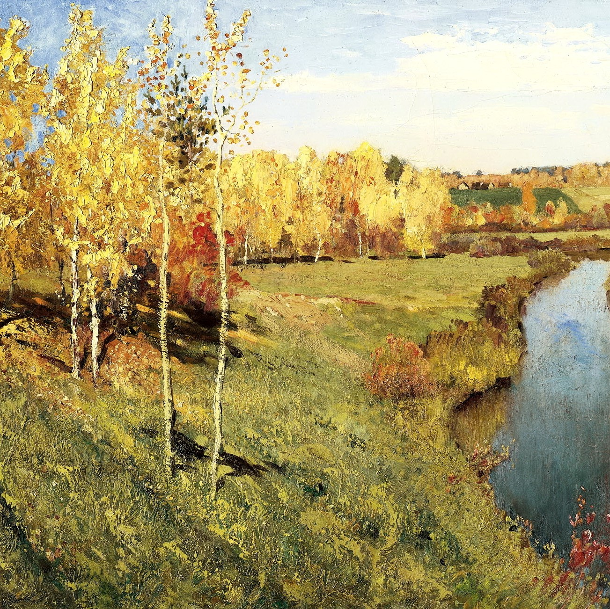

## НТИ. Машинное обучение и нейронные сети

0. Открыть нейронную сеть в Google Colab 

1. NeuralStyleTransfer

picasso.jpg 
dancing.jpg 
cloud.jpg 
scream.jpg 
emc.jpg 
kon.jpg 
les.jpg 
vangog001.jpg 
vangog002.jpg 
vangog003.jpg 
mone001.jpg 
mone002.jpg 
kandi001.jpg 
kandi002.jpg 
levitan001.jpg 
levitan002.jpg 
